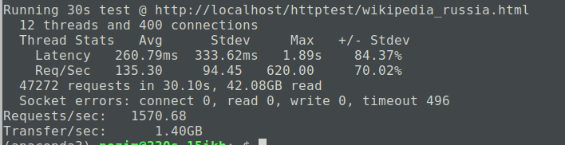
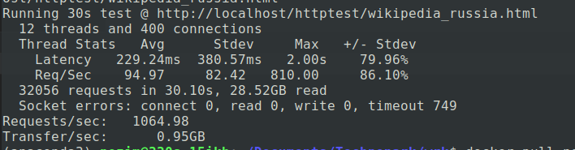
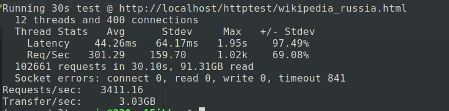
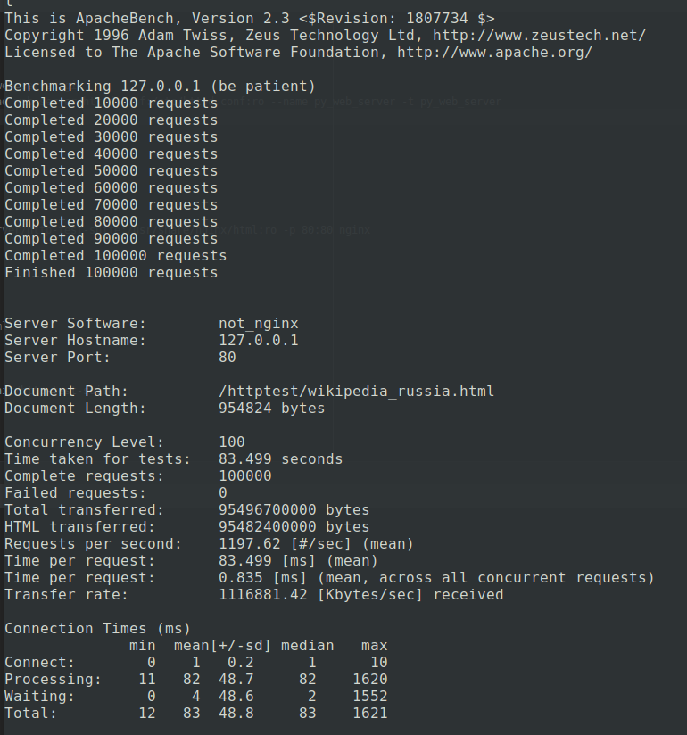
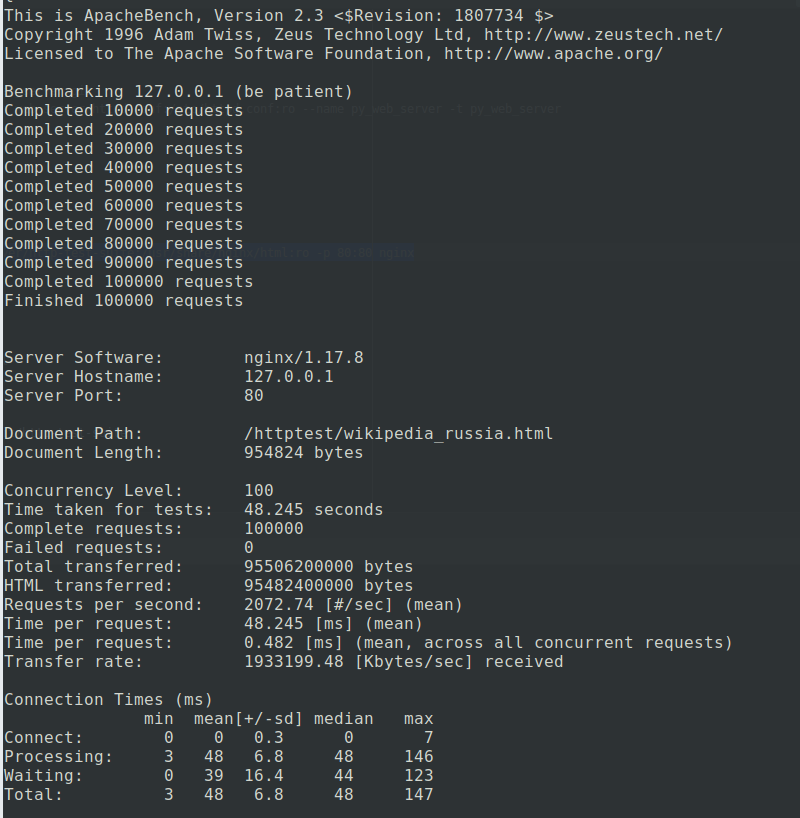

## Python web server with non-blocking io

Веб-сервер для отдачи статики с диска

Используется неблокирующий ввод/вывод, кооперативная многозадачность, асинхронное программирование с помощью библиотеки AsyncIO, так как операции в веб-сервере являются IO bound (больше висят попеременно в ожидании ввода/вывода)
 
### Run

```
cd /tmp
git clone https://github.com/zelflod/highload_web_server.git

docker build -t py_web_server https://github.com/zelflod/highload_web_server.git
docker run -it -p 80:80 -v /tmp/highload_web_server/httpd.conf:/etc/httpd.conf:ro --name py_web_server -t py_web_server

# sudo docker start -a py_web_server
```

Требования и методика тестирования (корректности работы) по ссылке: https://github.com/init/http-test-suite

### Нагрузочное тестирование и проверка стабильности

```
wrk -t12 -c400 -d30s http://localhost/httptest/wikipedia_russia.html 
```
##### py_web_serber with 8 CPU use



##### py_web_serber with 2 CPU use



##### nginx with with default (all) CPU use




```
ab -n 100000 -c 100 127.0.0.1/httptest/wikipedia_russia.html
```

##### py_web_server with 8 CPU use




##### nginx with with default (all) CPU use



### Run nginx (to compare performance)

```
docker run -it -v /tmp/highload_web_server/http-test-suite:/usr/share/nginx/html:ro -p 80:80 nginx
```